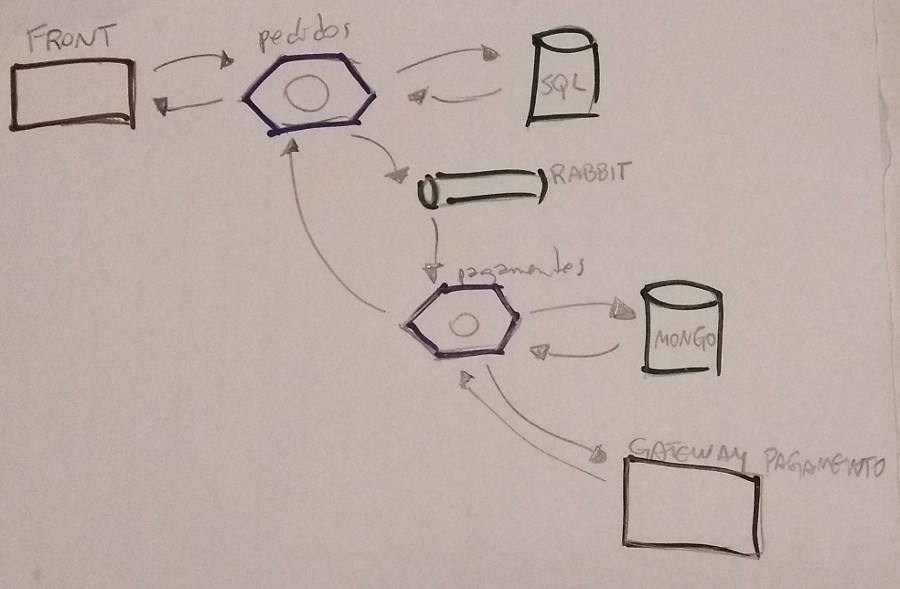
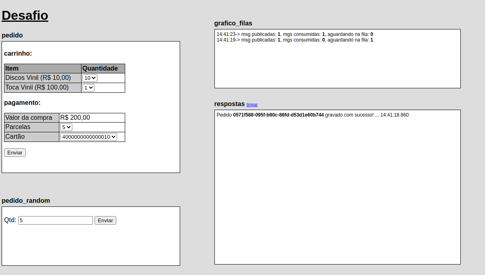

# Desafio

Para iniciar o projeto use o comando: 
```
docker-compose up -d
```
Será construída uma imagem do PHP 7.4 com suporte a CLI, Composer, RabbitMQ e MongoDB.

Serão iniciados 4 containers conforme lista abaixo:
- RabbitMQ 3.6;
- MongoDB 4.2;
- PHP 7.4 com API Pedidos (Lumen 7);
- PHP 7.4 com Worker Pagamentos;

## Solução:


## GUI para teste da solução:


## Acesso ao teste de integração: 
[http://localhost:8080/desafio.html](http://localhost:8080/desafio.html)

## Acesso aos pedidos:
[http://localhost:8080/pedidos](http://localhost:8080/pedidos)

## Dados para acesso ao RabbitMQ:
[http://localhost:15672](http://localhost:15672)
```
  u: guest
  s: guest
```

A fila "pagamentos" é criada automaticamente.

## Dados para acesso ao MongoDB:
```
  localhost
  u: teste
  s: 1234
```

A coleção "pagamentos" é criada automaticamente.

### TODO:
- gráficos das filas :neutral_face:
- benchmark das etapas de pagamento 
- implementar non-blocking I/O no worker 
- testes unitários e de integração
- revisão da arquitetura do software
- diagramar o desenho da solução
- logs, logs, logs :confused:
- <strike>circuit breaker no start do worker de pagamento</strike> :sunglasses:
- desacoplar GUI
- variáveis de ambiente configuráveis
- toogle no polling do gráfico de filas
- atualização do gráfico de filas via websocket
